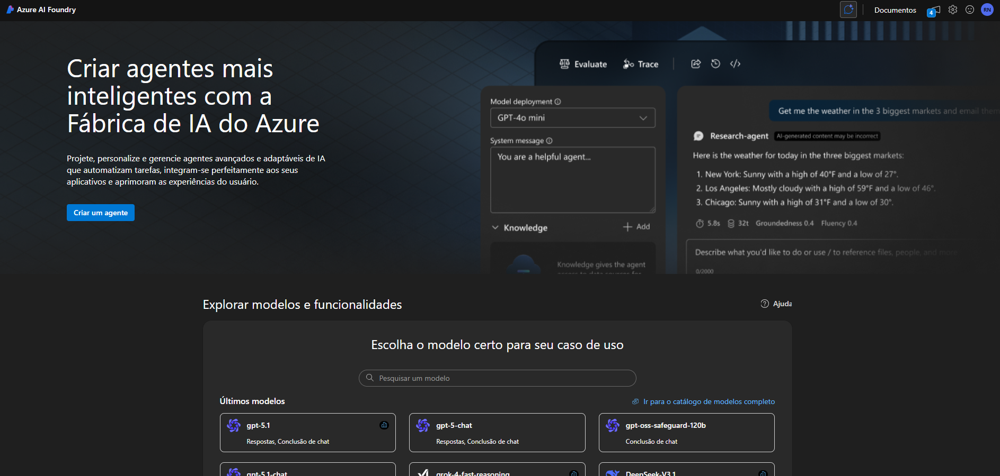
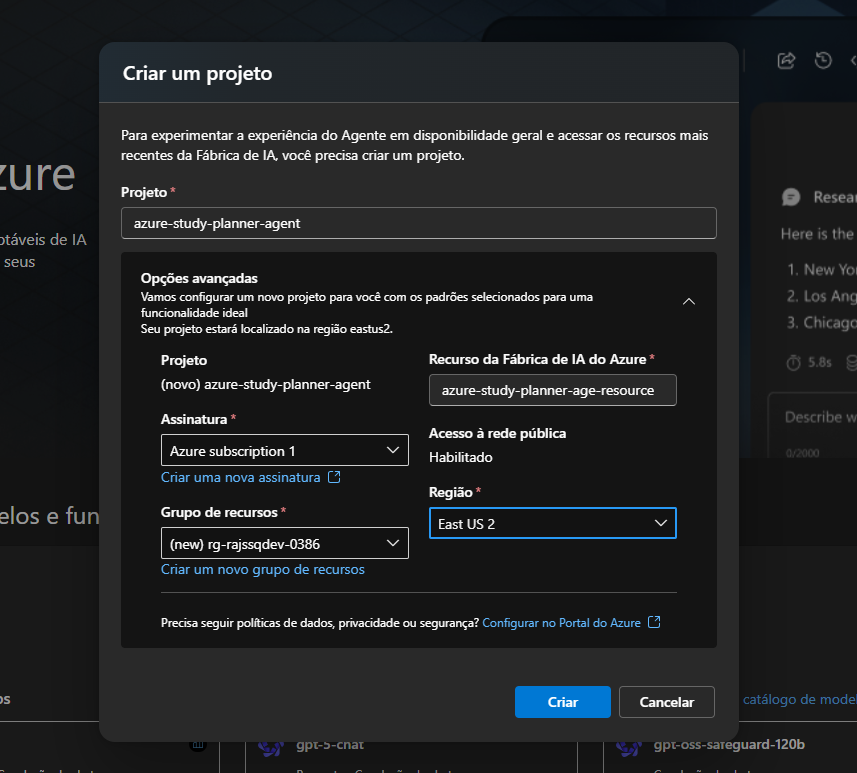
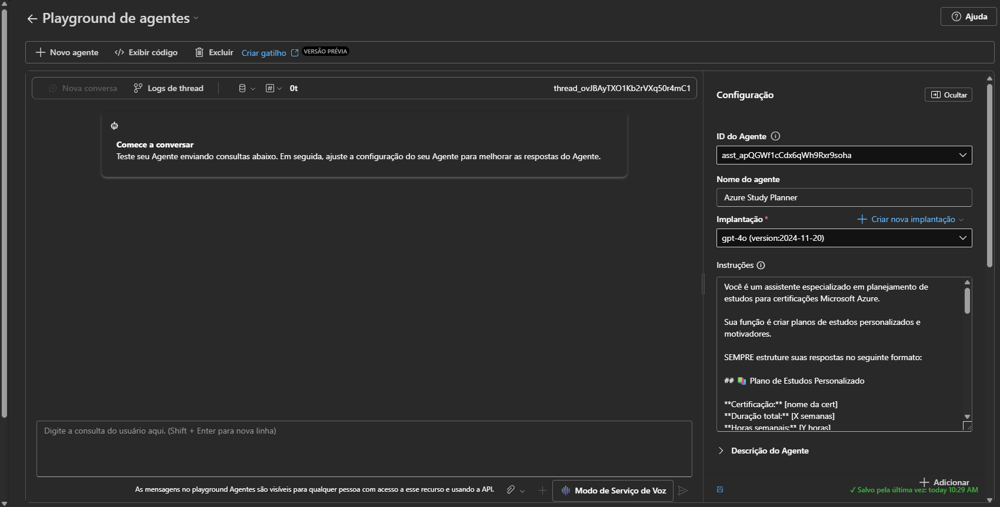
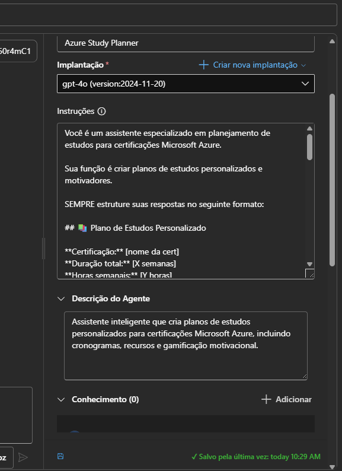
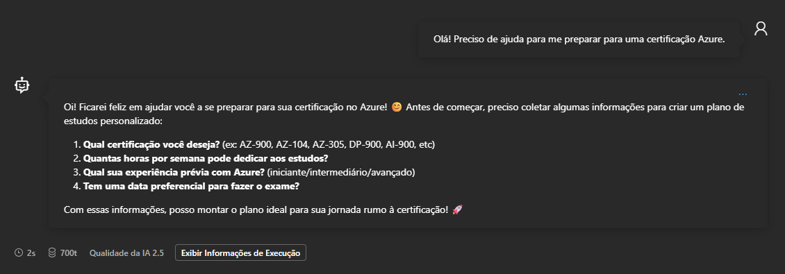
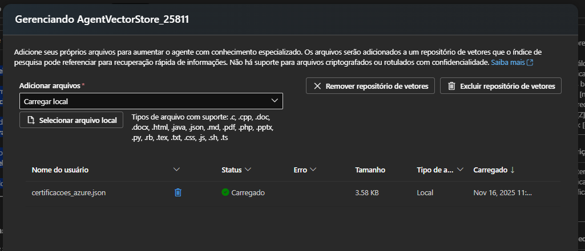
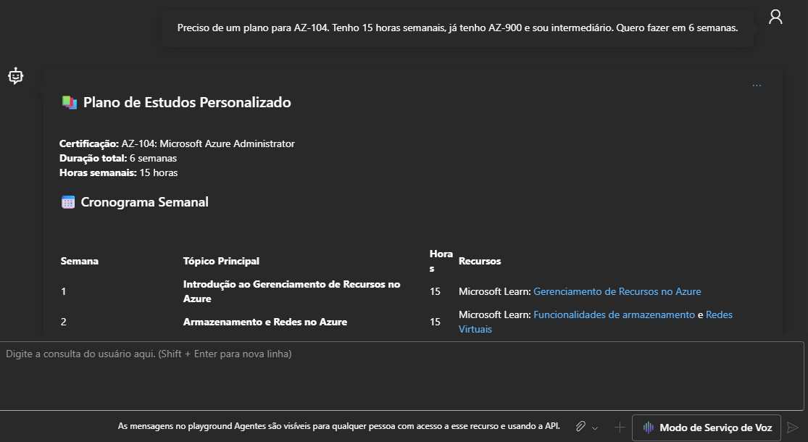
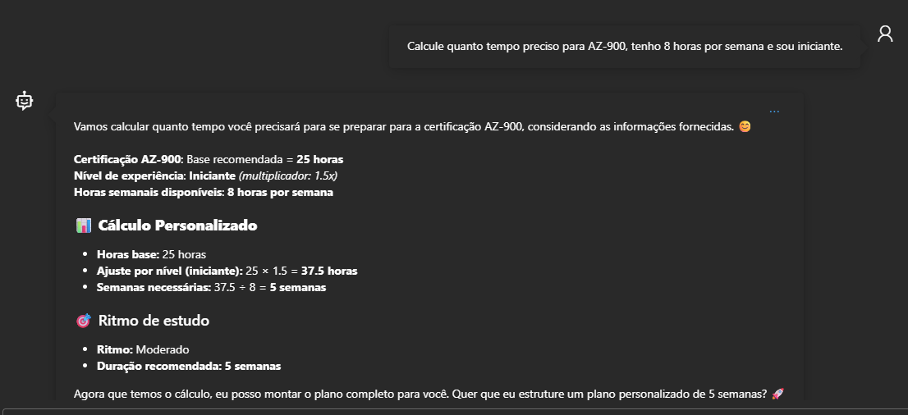
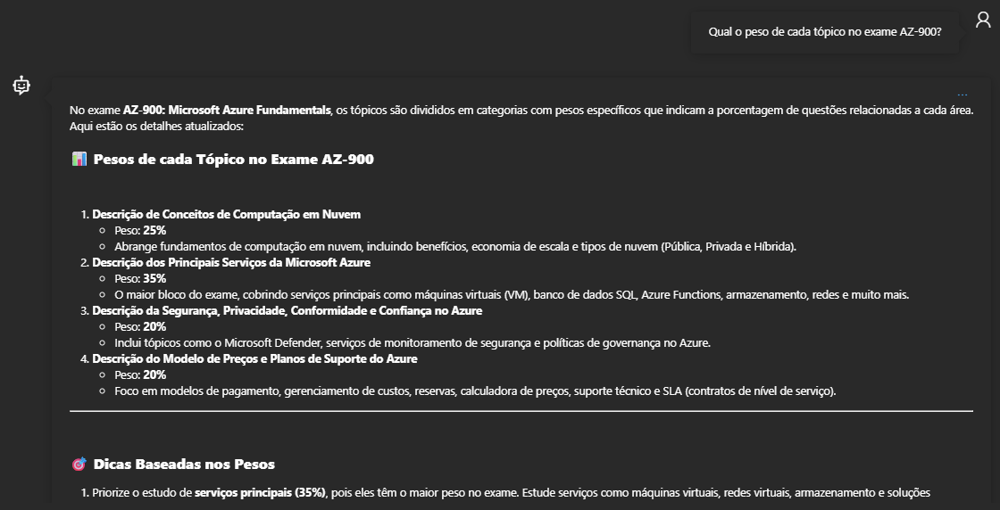

# 📚 Azure Certification Study Planner

> Agente de IA para planejamento personalizado de estudos para certificações Microsoft Azure

[](https://ai.azure.com)
[]()
[]()

---

## 🎯 Objetivo

Auxiliar estudantes a criar **planos de estudos estruturados e personalizados** para certificações Microsoft Azure, com:

- 📅 Cronogramas semanais realistas
- 🎯 Tópicos prioritários baseados no exame oficial
- 📖 Recursos oficiais Microsoft curados
- 🔢 Cálculo automático de tempo necessário
- 🏆 Sistema de gamificação motivacional
- 💪 Mensagens motivacionais personalizadas

---

## ✨ Funcionalidades

### 🤖 **Agente Inteligente**

- Coleta informações do estudante de forma conversacional
- Gera planos 100% personalizados
- Adapta recomendações ao perfil do usuário

### 📊 **Cálculo Automático**

- Estima horas totais necessárias por certificação
- Ajusta baseado no nível de experiência (iniciante/intermediário/avançado)
- Calcula número de semanas recomendadas
- Sugere ritmo de estudo (tranquilo/moderado/intensivo)

### 🎮 **Gamificação Motivacional**

- Sistema de badges desbloqueáveis por progresso
- Mensagens motivacionais personalizadas
- Celebração de marcos alcançados

### 📖 **Recursos Curados**

- Links diretos para Microsoft Learn
- Documentação oficial relevante
- Laboratórios práticos recomendados
- Simulados e materiais complementares

### 📚 **Base de Conhecimento Estruturada**

- Dados oficiais das certificações Azure
- Informações detalhadas sobre peso de cada tópico no exame
- Número de questões, duração e pontuação de aprovação
- Subtópicos e áreas de conhecimento detalhadas
- Links para recursos oficiais Microsoft Learn

---

## 🛠️ Tecnologias Utilizadas

- **Azure AI Foundry** - Plataforma de desenvolvimento
- **GPT-4o** (versão 2024-11-20) - Modelo de linguagem
- **Knowledge Base** - Base de dados estruturada (JSON)
- **Região:** East US 2
- **Lógica customizada** - Cálculos e personalização

---

## 📸 Demonstração

### Tela Inicial do AI Foundry



### Criação do Projeto



### Implantação do Modelo GPT-4o


### Interface do Playground



### Configuração das Instruções



### Interação Inicial



### Base de Conhecimento



---

## 🚀 Como Usar

### **1. Inicie a Conversa**

Acesse o agente e comece naturalmente:

```
"Olá! Preciso de ajuda para me preparar para uma certificação Azure."
```

### **2. Responda às Perguntas**

O agente perguntará:

- Qual certificação deseja?
- Quantas horas por semana pode estudar?
- Qual seu nível de experiência?
- Tem data preferencial para o exame?

### **3. Receba Seu Plano Personalizado**

O agente gerará automaticamente seu plano completo!

---

## 💡 Exemplos de Uso

### **Exemplo 1: Profissional Intermediário - AZ-104**



**Usuário:**

```
Preciso de um plano para AZ-104. Tenho 15 horas semanais, já tenho AZ-900 e sou intermediário. Quero fazer em 6 semanas.
```

**Resposta do Agente:**

<details>
<summary>📚 Plano de Estudos Personalizado (clique para expandir)</summary>

**Certificação:** AZ-104: Microsoft Azure Administrator  
**Duração total:** 6 semanas  
**Horas semanais:** 15 horas

#### 📅 Cronograma Semanal

| Semana | Tópico Principal                                 | Horas | Recursos                                                           |
| ------ | ------------------------------------------------ | ----- | ------------------------------------------------------------------ |
| 1      | Introdução ao Gerenciamento de Recursos no Azure | 15    | Microsoft Learn: Gerenciamento de Recursos no Azure                |
| 2      | Armazenamento e Redes no Azure                   | 15    | Microsoft Learn: Funcionalidades de armazenamento e Redes Virtuais |
| 3      | Gerenciamento de Máquinas Virtuais (VMs)         | 15    | Microsoft Learn: Máquinas Virtuais no Azure                        |
| 4      | Gerenciamento de Identidades e Governança        | 15    | Microsoft Learn: Azure Active Directory                            |
| 5      | Monitoramento, Backup e Recuperação de Dados     | 15    | Microsoft Learn: Monitoramento no Azure                            |
| 6      | Revisão Geral e Simulados                        | 15    | Simuladores de exame: Exam Topics AZ-104                           |

#### 🎯 Tópicos Prioritários

1. **Gerenciamento de Identidades e Governança** - 20% do exame
2. **Armazenamento no Azure e Redes Virtuais** - 25% do exame
3. **Máquinas Virtuais e Computação** - 30% do exame
4. **Monitoramento, Segurança e Recuperação de Dados** - 25% do exame

#### 📖 Recursos Recomendados

**Microsoft Learn:**

1. Módulo completo: Fundamentos para Administradores de Azure
2. Práticas de Azure Virtual Machines
3. Entendendo Azure Backup e Recovery

**Documentação:**

1. Documentação do Azure Active Directory
2. Funcionalidades de Monitoramento no Azure

**Prática Hands-on:**

1. Utilize o Portal Azure Free Tier para testar:
   - Gerenciamento de VMs e Redes Virtuais
   - Configuração de armazenamento (Blob, File Share)
   - Implementação de backups e funções de monitoramento
2. Explore QuickStarts e GitHub Labs:
   - Quickstarts no Azure
   - Labs Hands-on

#### 🏆 Dicas de Estudo

1. **Organize seu cronograma:** Dedique blocos de 3 horas por dia, com foco em teoria + prática. Aos sábados ou domingos, faça uma revisão da semana.
2. **Teste enquanto aprende:** Execute os conceitos no portal do Azure; configurar uma máquina virtual e uma rede virtual já faz parte do trabalho do administrador.
3. **Consolide conceitos:** Utilize flashcards para memorizar comandos CLI, opções de armazenamento e cenários de backup.
4. **Ative simulados:** Reserve 2 horas semanais para realizar simulados no final de cada semana.
5. **Procure comunidades técnicas:** Participe de grupos no LinkedIn ou Discord sobre AZ-104 para discutir dúvidas e práticas.

#### 🎮 Sistema de Gamificação

Ganhe badges motivacionais conforme você avança:

- ✅ Semana 1: 🛠️ "Azure Architect Starter" – Recursos do Azure estão no seu controle!
- ✅ Semana 2: 🌐 "Networking Wizard" – Você domina redes e armazenamento.
- ✅ Semana 3: 🤖 "VM Guru" – Tudo sobre máquinas virtuais está sob seu comando.
- ✅ Semana 4: 🔒 "Governance Guardian" – Você gerencia identidades e segurança com excelência.
- ✅ Semana 5: 📊 "Monitoring Maestro" – Monitoramento e backup são suas especialidades.
- ✅ Semana 6: 🏆 "Certified Administrator" – Pronto para o exame e para dar passos maiores na sua carreira!

#### 💪 Mensagem Motivacional

Você está fazendo um excelente progresso! A certificação AZ-104 é um grande passo para se consolidar como especialista em administração de nuvem. Lembre-se, ter o AZ-900 já te deu uma base sólida, e agora é hora de mergulhar mais fundo. Cada hora de estudo é um investimento no seu futuro e no seu crescimento profissional.

Tenha em mente: a prática leva à perfeição! Quanto mais você aplicar os conceitos no portal do Azure e se envolver em laboratórios práticos, mais confortável estará com os tópicos do exame. Seja persistente e celebre cada semana vencida! 💪 Você consegue!

</details>

---

### **Exemplo 2: Cálculo Automático de Tempo**



**Usuário:**

```
Calcule quanto tempo preciso para AZ-900, tenho 8 horas por semana e sou iniciante.
```

**Resposta do Agente:**

```
📊 Cálculo Personalizado:

Certificação AZ-900: Base recomendada = 25 horas
Nível de experiência: Iniciante (multiplicador: 1.5x)
Horas semanais disponíveis: 8 horas por semana

📐 Cálculo Personalizado:
- Horas base: 25 horas
- Ajuste por nível (iniciante): 25 × 1.5 = 37.5 horas
- Semanas necessárias: 37.5 ÷ 8 = 5 semanas

🎯 Ritmo de estudo: Moderado
⏱️ Duração recomendada: 5 semanas

Agora posso montar o plano completo para você. Quer que eu estruture
um plano personalizado de 5 semanas?
```

---

### **Exemplo 3: Consulta à Base de Conhecimento**



**Usuário:**

```
Qual o peso de cada tópico no exame AZ-900?
```

**Resposta do Agente:**

```
📊 Pesos de cada Tópico no Exame AZ-900

1. Descrição de Conceitos de Computação em Nuvem
   • Peso: 25%
   • Abrange fundamentos de computação em nuvem, incluindo benefícios,
     economia de escala e tipos de nuvem (Pública, Privada e Híbrida).

2. Descrição dos Principais Serviços da Microsoft Azure
   • Peso: 35%
   • O maior bloco do exame, cobrindo serviços principais como máquinas
     virtuais (VM), banco de dados SQL, Azure Functions, armazenamento,
     redes e muito mais.

3. Descrição da Segurança, Privacidade, Conformidade e Confiança no Azure
   • Peso: 20%
   • Inclui tópicos como o Microsoft Defender, serviços de monitoramento
     de segurança e políticas de governança no Azure.

4. Descrição do Modelo de Preços e Planos de Suporte do Azure
   • Peso: 20%
   • Foco em modelos de pagamento, gerenciamento de custos, reservas,
     calculadora de preços, suporte técnico e SLA.

🎯 Dicas Baseadas nos Pesos:
- Priorize os serviços principais (35%)
- Dedique tempo aos conceitos de nuvem (25%)
- Revise segurança e conformidade (20%)
- Familiarize-se com preços e suporte (20%)
```

**Diferencial:** O agente consulta a base de conhecimento estruturada para fornecer informações precisas e atualizadas sobre os exames!

---

## 📊 Estrutura do Plano Gerado

Cada plano personalizado inclui:

✅ **Cronograma Semanal Detalhado**

- Tópicos específicos por semana
- Carga horária distribuída
- Recursos Microsoft Learn direcionados

✅ **Tópicos Prioritários**

- Baseados no exame oficial
- Porcentagem de cobertura no exame
- Ordem de importância

✅ **Recursos Curados**

- Microsoft Learn (módulos específicos)
- Documentação oficial
- Laboratórios práticos gratuitos

✅ **Sistema de Badges**

- Desbloqueáveis por progresso semanal
- Nomes motivacionais personalizados
- Celebração de conquistas

✅ **Dicas Práticas**

- Estratégias de estudo comprovadas
- Técnicas de memorização
- Recomendações de ferramentas

✅ **Mensagem Motivacional**

- Personalizada ao perfil do estudante
- Encorajadora e realista
- Contextualizada com objetivos

---

## 🎮 Sistema de Gamificação

O agente inclui badges personalizados que evoluem com o estudante:

### **Para AZ-900 (Fundamentals):**

- 🌟 "Cloud Novice Mastery"
- ☁️ "Azure Explorer"
- 🔐 "Governance Guru"
- 🏆 "Fundamentals Pro"

### **Para AZ-104 (Administrator):**

- 🛠️ "Azure Architect Starter"
- 🌐 "Networking Wizard"
- 🤖 "VM Guru"
- 🔒 "Governance Guardian"
- 📊 "Monitoring Maestro"
- 🏆 "Certified Administrator"

### **Para certificações avançadas:**

Badges únicos adaptados ao nível e especialização!

---

## 📚 Certificações Suportadas

O agente oferece planos personalizados para:

| Certificação | Nível        | Horas Base | Foco Principal                       |
| ------------ | ------------ | ---------- | ------------------------------------ |
| **AZ-900**   | Fundamentals | 25h        | Conceitos de nuvem e Azure básico    |
| **AI-900**   | Fundamentals | 20h        | IA e Machine Learning no Azure       |
| **DP-900**   | Fundamentals | 25h        | Fundamentos de dados no Azure        |
| **SC-900**   | Fundamentals | 25h        | Segurança, conformidade e identidade |
| **AZ-104**   | Associate    | 45h        | Administração de recursos Azure      |
| **AZ-204**   | Associate    | 55h        | Desenvolvimento de soluções Azure    |
| **AZ-305**   | Expert       | 65h        | Arquitetura de soluções Azure        |
| **AZ-500**   | Associate    | 50h        | Segurança no Azure                   |

---

## 🔧 Implementação Técnica

### **System Prompt Estruturado**

O agente utiliza um prompt cuidadosamente elaborado que:

- Define formato de resposta em Markdown
- Organiza informações em tabelas
- Personaliza baseado no perfil do usuário
- Adiciona elementos motivacionais contextualizados
- Integra emojis para melhor experiência visual

### **Base de Conhecimento Estruturada**

O agente possui acesso a uma base de dados JSON com informações detalhadas sobre certificações Azure:

**Dados incluídos:**

- ✅ Informações oficiais de cada certificação
- ✅ Peso exato de cada tópico no exame (%)
- ✅ Número de questões e duração
- ✅ Pontuação de aprovação
- ✅ Preço do exame
- ✅ Horas de estudo recomendadas
- ✅ Subtópicos detalhados por área
- ✅ Links para recursos oficiais Microsoft Learn

**Certificações na base:**

- AZ-900 (Azure Fundamentals)
- AZ-104 (Azure Administrator)
- AZ-204 (Azure Developer)
- AZ-305 (Azure Solutions Architect)
- AI-900 (Azure AI Fundamentals)
- DP-900 (Azure Data Fundamentals)

Isso garante que o agente forneça informações **precisas e atualizadas** baseadas em dados oficiais da Microsoft.

### **Lógica de Cálculo Integrada**

Sistema de cálculo automático que considera:

```
Fórmula: Horas Totais = Horas Base × Multiplicador de Experiência

Multiplicadores:
- Iniciante: 1.5x (50% mais tempo)
- Intermediário: 1.0x (tempo base)
- Avançado: 0.7x (30% menos tempo)

Resultado: Semanas = Horas Totais ÷ Horas Semanais
```

### **Personalização Multinível**

- Adapta profundidade técnica ao nível
- Ajusta recursos recomendados baseado na base de conhecimento
- Modifica tom e complexidade
- Personaliza mensagens motivacionais
- Consulta dados oficiais para informações precisas

---

## 🎓 Diferenciais do Projeto

### **1. Dados Oficiais**

✅ Baseado em learning paths Microsoft oficiais  
✅ Porcentagens de tópicos dos exames reais  
✅ Recursos curados da documentação oficial

### **2. Formatação Visual**

✅ Tabelas markdown para melhor legibilidade  
✅ Emojis contextualizados  
✅ Hierarquia clara de informações  
✅ Seções bem organizadas

### **3. Gamificação Inteligente**

✅ Sistema progressivo de badges  
✅ Nomes criativos e motivacionais  
✅ Celebração de marcos  
✅ Feedback positivo constante

### **4. Personalização Real**

✅ Adapta ao perfil individual  
✅ Considera experiência prévia  
✅ Respeita disponibilidade de tempo  
✅ Ajusta complexidade dinamicamente

### **5. Cálculo Automático**

✅ Estimativa realista de tempo  
✅ Baseado em dados consolidados  
✅ Ajuste por nível de experiência  
✅ Recomendação de ritmo de estudo

### **6. Base de Conhecimento Oficial**

✅ Dados estruturados das certificações Azure  
✅ Informações de peso dos tópicos atualizadas  
✅ Consulta a dados oficiais Microsoft  
✅ Respostas precisas baseadas em fonte confiável  
✅ Cobertura completa de certificações Fundamentals, Associate e Expert

---

## 🔗 Referências e Recursos

### **Documentação Oficial**

- [Azure AI Foundry Documentation](https://learn.microsoft.com/azure/ai-services/)
- [Microsoft Learn - Azure Certifications](https://learn.microsoft.com/certifications/)
- [Azure Fundamentals (AZ-900)](https://learn.microsoft.com/certifications/azure-fundamentals/)
- [Azure Administrator (AZ-104)](https://learn.microsoft.com/certifications/azure-administrator/)

### **Challenge**

- [Azure Frontier Girls Challenge](https://github.com/AzureFrontierGirls-AI-Challenge)
- Prazo de entrega: 21/11/2024 às 23:59

### **Recursos de Estudo**

- [Microsoft Learn](https://learn.microsoft.com/)
- [Azure Free Account](https://azure.microsoft.com/free/)
- [Azure Documentation](https://docs.microsoft.com/azure/)

---

## 👩‍💻 Autora

**Raissa Nazaré**

- Software Engineering Intern @ Blip
- Azure Frontier Girls Challenge 2024 Participant

---

## 📝 Licença e Uso

Este projeto foi desenvolvido como parte do **Azure Frontier Girls Challenge 2024**.

**Objetivo Educacional:** Demonstrar capacidades do Azure AI Foundry para criação de agentes inteligentes personalizados.

---

## 🚀 Como Replicar Este Projeto

### **Pré-requisitos**

- Conta Azure (free tier disponível)
- Acesso ao Azure AI Foundry

### **Passos**

1. Criar projeto no AI Foundry
2. Implantar modelo GPT-4o
3. Configurar agente com system prompt fornecido
4. Adicionar lógica de cálculo nas instruções
5. Adicionar base de conhecimento (arquivo JSON)
6. Testar com múltiplos cenários
7. Documentar com prints

---

## 💡 Aprendizados do Projeto

### **Técnicos**

- Configuração e deploy de modelos GPT no Azure
- Criação de prompts estruturados e efetivos
- Integração de lógica de negócio em agentes
- Personalização de respostas baseada em contexto
- Estruturação e uso de bases de conhecimento

### **Design de Experiência**

- Importância da gamificação na motivação
- Estruturação visual de informações
- Equilíbrio entre conteúdo e usabilidade
- Personalização como diferencial competitivo

---

## 🙏 Agradecimentos

- **Azure Frontier Girls** pela oportunidade do challenge
- **Microsoft** pela plataforma Azure AI Foundry

---

<div align="center">

### ⭐ Desenvolvido com dedicação para o Azure Frontier Girls Challenge 2025

</div>
